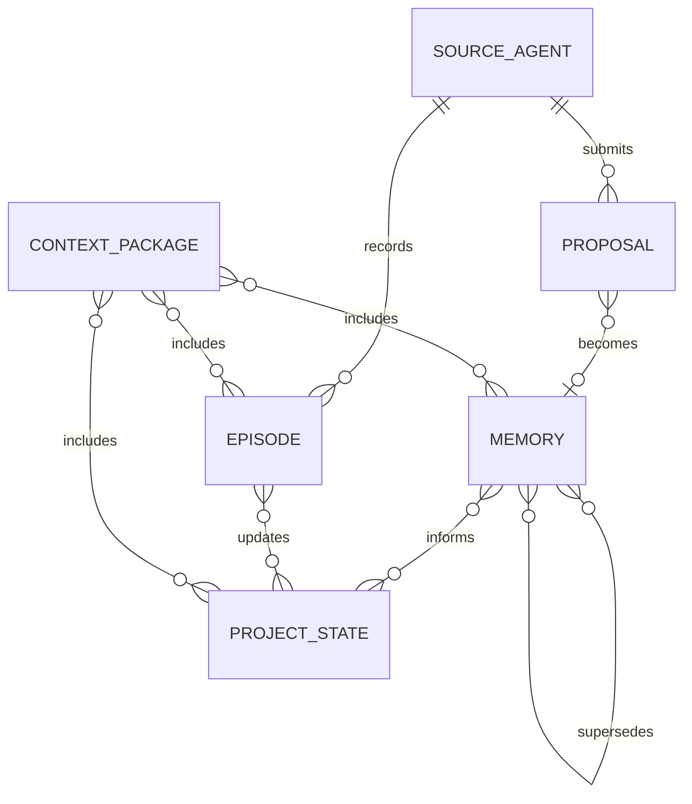

> **Status**: `active`

# MemBridge Architecture Overview

## 文档导航

- [00-overview.md](00-overview.md)：定义 MemBridge 的全局目标、模块边界、核心实体、主流程和安全边界。

## 系统目标与约束

MemBridge 是面向个人与项目工作流的 Obsidian-based shared memory layer，为 Claude、Codex、OpenClaw、Pi wrapper 和其他本地 Agent 提供统一、可治理、可审计的上下文读写能力。

核心约束：

- Obsidian Vault 是人工可读写的 canonical memory store；Agent 不直接写正式记忆目录。
- Agent 接入通过语义化入口完成；系统不向 Agent 暴露通用文件删除能力。
- MCP Server 与 CLI 共享同一 Gateway Core；记忆分类、校验、去重、提交逻辑只存在一份。
- 每条长期记忆保留来源、状态、作用域、证据和变更关系；缺失任一项的长期记忆不得进入 active 状态。
- 检索结果以 context package 返回；调用方不直接消费未筛选的 chunk 列表。

## 核心设计原则

- **Vault as Source of Truth**：正式记忆以 Markdown 文件落在 Vault 中。理由是用户可以直接阅读、编辑、审计和用 Git 追踪变更。
- **Governed Write Path**：Agent 只提交 proposal、episode 和 task state。理由是长期偏好、事实和决策需要来源与审批边界。
- **Semantic Interfaces**：对外入口表达记忆意图，而不是文件操作。理由是不同 Agent 共享行为契约，不绑定 Obsidian 文件结构。
- **CLI First, MCP Primary**：先用 CLI 验证 Gateway Core，再映射到 MCP 工具。理由是 CLI 可本地调试，MCP 是 Agent 自主读写的正式通道。
- **Context Package over Search Hits**：读取返回整理后的事实、项目背景、事件摘要、决策和来源。理由是 Agent 需要可注入上下文，而不是检索系统内部结果。

## 关键设计决策

| 决策问题 | 选择 | 放弃的替代方案 | 理由 | 变更条件 |
|---------|------|--------------|------|----------|
| 正式记忆存放在哪里？ | Obsidian Vault 中的 Markdown 文件 | 只存 SQLite 或向量库 | Vault 保留人类可读性、双链、Git 审计和手工编辑能力 | 用户放弃 Obsidian 作为主要工作流 |
| Agent 如何接入系统？ | MCP 作为 Agent 主入口，CLI 作为调试和自动化入口 | 只做 MCP 或只做 CLI | MCP 适配 Agent 自主调用，CLI 适配本地脚本、批量导入和索引维护 | 目标 Agent 全部不支持 MCP |
| MCP 与 CLI 如何复用逻辑？ | 两者调用同一个 Gateway Core | MCP 与 CLI 各自实现业务逻辑 | 单一核心避免分类、校验、去重和写入规则分叉 | Gateway Core 无法满足任一入口的稳定契约 |
| Agent 能否直接提交 active 记忆？ | Agent 提交 proposal，Gateway 或人类完成 commit | Agent 直接写 active 记忆 | proposal 流程降低错误事实、重复记忆和隐私内容进入长期记忆的风险 | 用户明确授权某一低风险类型自动 commit |
| 检索层如何定位？ | Vault 是源，SQLite/vector/graph index 是派生加速层 | 索引库作为主存储 | 派生索引可以重建，Vault 保持可审计事实来源 | Vault 不能承载目标数据规模 |

## 边界划分

```text
Agent Clients / Scripts
        |
        v
MCP Server        CLI
        \          /
         v        v
       Gateway Core
        |    |    |
        |    |    +--> Index Store
        |    +------> Obsidian Vault Adapter
        +----------> Policy Engine
```

- **MCP Server**：向支持 MCP 的 Agent 暴露语义化 memory tools，不负责记忆治理规则。
- **CLI**：向用户、脚本和自动化流程暴露本地命令，不负责独立实现业务逻辑。
- **Gateway Core**：拥有记忆分类、校验、去重、proposal、episode、task state 和 context package 组装规则。
- **Policy Engine**：拥有写入审批、敏感内容拒绝、冲突判定和状态转换规则。
- **Obsidian Vault Adapter**：拥有 Vault 文件布局和 Markdown/frontmatter 读写细节。
- **Index Store**：拥有检索索引和派生查询数据，可从 Vault 全量重建。

跨切关注点：

- 日志、审计事件和错误翻译由 Gateway Core 的基础设施组件统一处理。
- 配置加载由入口层注入 Gateway Core；业务模块不直接读取全局环境。
- 密钥与访问令牌只存在入口层和 Vault Adapter 运行环境中，不写入记忆文件。

## 核心实体关系

**Memory**：系统管理的一条长期上下文单元，承载偏好、事实、项目上下文、决策或知识。

**Proposal**：Agent 或用户提交的待治理记忆候选，经过校验、去重和审批后转为 Memory 或被拒绝。

**Episode**：一次会话、任务或事件的摘要记录，用于恢复近期上下文。

**ProjectState**：某个项目的当前背景、任务状态、阻塞点和活动决策。

**SourceAgent**：提交读取或写入请求的外部 Agent、脚本或人工入口。

**ContextPackage**：Gateway Core 为一次任务组装的可注入上下文集合，包含内容摘要和来源引用。



## 整体流程

写入主路径：

```text
Agent or CLI
  -> MCP Server or CLI
  -> Gateway Core
  -> Policy Engine
  -> 00_Inbox proposal or episode
  -> Obsidian Vault
  -> Index Store refresh
```

读取主路径：

```text
Agent or CLI
  -> MCP Server or CLI
  -> Gateway Core
  -> Index Store query + Vault source lookup
  -> Policy Engine visibility filter
  -> ContextPackage
```

## 部署架构

MVP 运行在单机本地环境：

```text
Local machine
  ├─ Obsidian Vault directory
  ├─ membridge CLI process
  ├─ membridge MCP Server process
  └─ local index files
```

## 安全架构

- 信任边界位于 Agent 入口与 Gateway Core 之间；入口必须声明 actor。
- Gateway Core 在写入前执行 schema 校验、状态约束和禁止内容检查。
- Agent 提交的长期事实、偏好、身份信息和敏感信息进入 proposal 队列，不直接进入 active 记忆。
- Vault Adapter 不接受跨越 Vault 根目录的路径。
