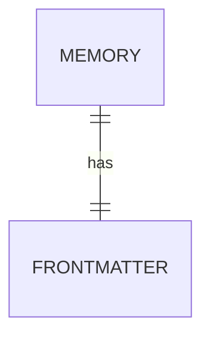

> **Status**: `active`

# MemBridge Architecture Overview

## 系统目标

MemBridge 是一个本地优先的 Obsidian 记忆层，为 Agent 提供统一的 Markdown 读写和 Frontmatter 过滤查询能力。

核心约束：

- Obsidian Vault 是唯一的记忆存储；每条记忆对应一个 Markdown 文件。
- Markdown 正文承载内容，YAML Frontmatter 承载可查询元数据。
- MCP Server 与 CLI 共享同一套 Core 逻辑。
- 查询通过 Frontmatter 字段过滤，返回匹配的文件列表及其元数据。

## 核心设计原则

- **One File = One Memory**：记忆即 Markdown 文件，符合 Obsidian 原生模型。
- **Frontmatter as Query Contract**：元数据存在 YAML Frontmatter 中，用户可在 Obsidian 中直接过滤、编辑。
- **CLI First**：先用 CLI 验证核心逻辑，再映射到 MCP 工具。
- **Read & Write Only**：MVP 只提供读取（查询）和写入（创建/更新 Markdown 文件）两种操作，不引入提案、事件、项目状态等额外实体。

## 架构

```text
Agent Clients / Scripts
        |
        v
MCP Server        CLI
        \          /
         v        v
       MemBridge Core
              |
              v
       Obsidian Vault Adapter
       (Markdown + YAML Frontmatter)
```

- **MCP Server**：向 Agent 暴露 read_memories / write_memory 工具。
- **CLI**：本地调试、批量导入、自动化脚本入口。
- **MemBridge Core**：Frontmatter 校验、文件读写、过滤查询。
- **Obsidian Vault Adapter**：Markdown 读写和 Frontmatter 解析。

## 核心实体

**Memory**：一条长期上下文，对应一个 Markdown 文件。

**Frontmatter**：Markdown 文件头部的 YAML 元数据，包含 status、type、scope、project、tags、source、created_at 等字段。



## 流程

**写入**：`CLI/MCP → Core（校验 Frontmatter）→ 写入 Markdown 文件 → Vault`

**读取**：`CLI/MCP → Core（按 Frontmatter 字段过滤）→ 返回匹配的文件列表`

## 安全

- Agent 不能直接删除文件。
- Vault Adapter 不接受跨越 Vault 根目录的路径。
- 敏感字段（API key、password、token）禁止写入记忆文件。